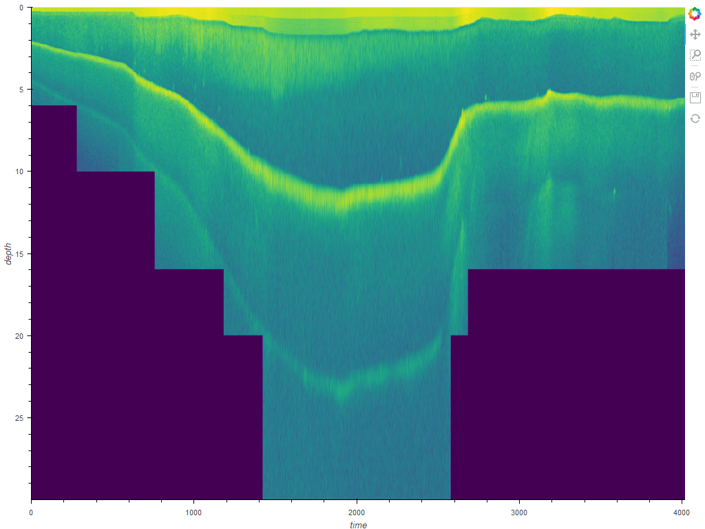
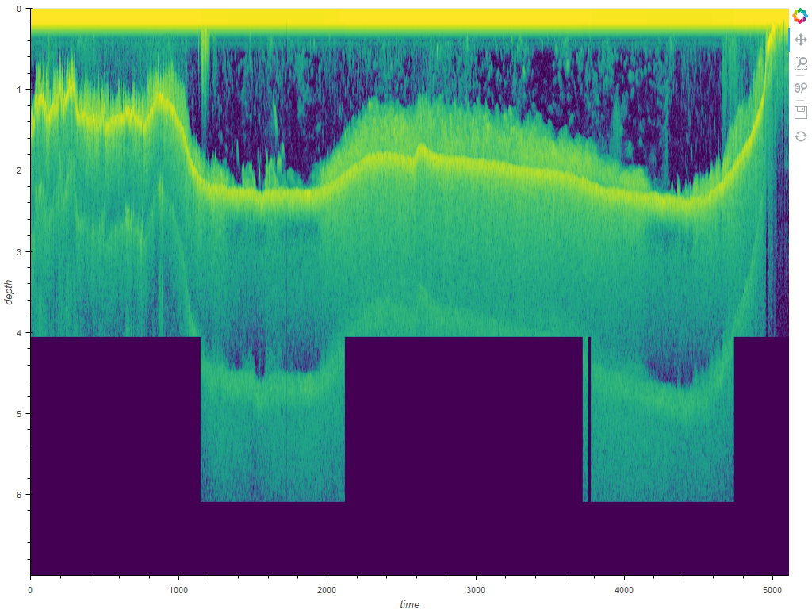
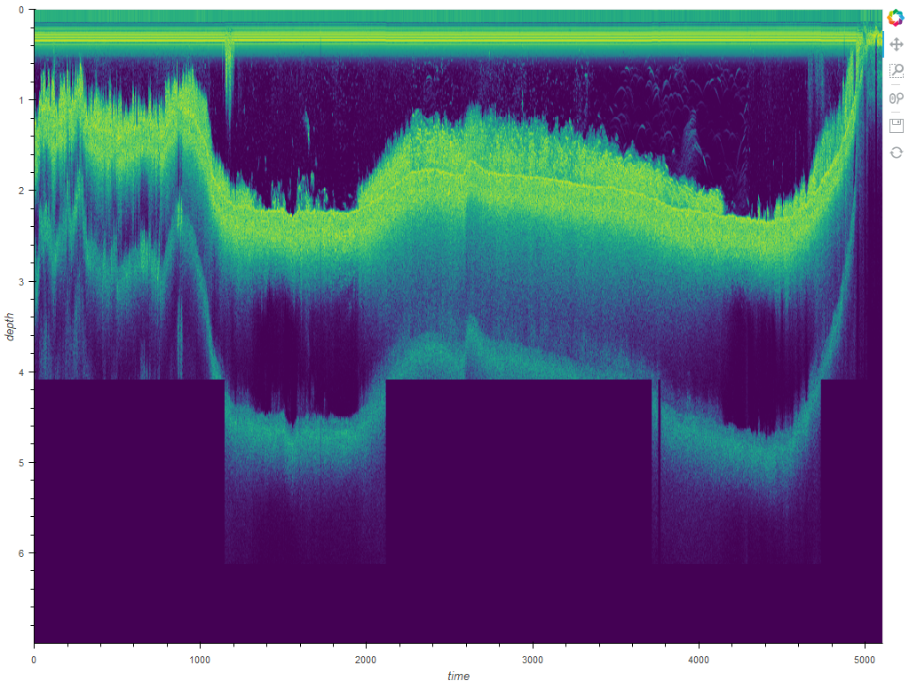
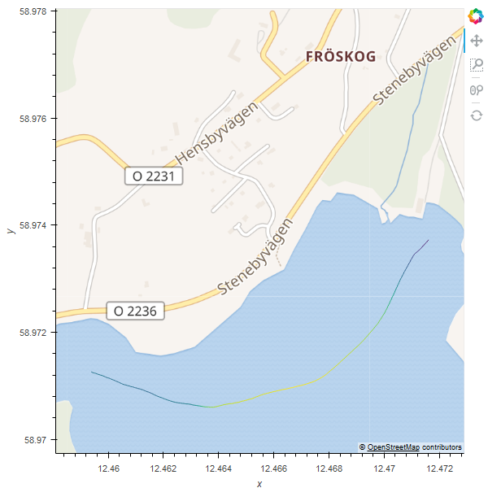
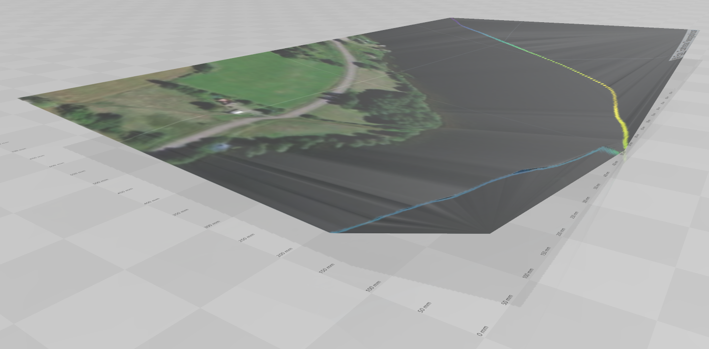
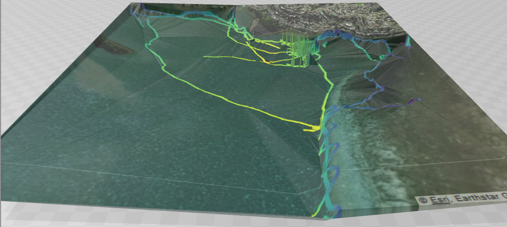

# sonar
This python library provides scripts for parsing, processing and graphing sonar log files from the command line. 

Currently only Lowrance sl2 sonar log files are supported and it has only been tested with logs from my Lowrance Elite 5 CHIRP sonar.

It supports the following features:
* Merging multiple sonar logs by position
* Creating a textured 3D depth map exported as a Wavefront OBJ file
* Creating an image showing the entire sonar return log
* Creating a 2D map of the traveled path from the sonar log
* Generating debug graphs to show all details from sonar logs

## Installation

NOTE: Seems the environment.yml isn't working at the moment I will be looking into that soon and improving it to freeze versions of requirements

Following are installation instructions for Linux (Similar instructions should work on other platforms too):
* Install anaconda (Or use you package manager if conda is available)
	* Go to https://www.anaconda.com and locate package to download
	* wget https://repo.anaconda.com/archive/Anaconda3-2020.02-Linux-x86_64.sh
	* bash Anaconda3-2020.02-Linux-x86_64.sh
		* Yes to conda init (Adds to .bashrc)
	* source ~/.bashrc
* git clone https://github.com/bjcosta/sonar.git
* cd sonar
* conda env update --file environment.yml
* conda activate sonar

## Running

Assuming you followed the above instructions to install, you can now try and run it on the small sample sonar log file included in this repository using the command line below. Following sections will describe and show examples of the files produced.

	> python src/gen_images.py data/small.sl2

	2020-06-11 12:48:24,995 INFO: Importing python modules (takes a long time with holoviews)...
	2020-06-11 12:48:39,470 INFO: Starting dask client (takes a long time also)...
	2020-06-11 12:49:03,281 INFO: Loading sonar file: data/small.sl2
	2020-06-11 12:49:31,683 INFO: Saving map image: data/gen/small.sl2.map.png
	2020-06-11 12:49:47,750 INFO: Saving sonar image: data/gen/small.sl2.primary.sonar.png
	2020-06-11 12:49:57,534 INFO: Saving depth map image: data/gen/small.sl2.quantized_map.png
	2020-06-11 12:49:58,765 INFO: Saving depth map 3D Waverfront OBJ: data/gen/small.sl2.quantized_map.obj

### Sonar Image

File produced: data/gen/small.sl2.primary.sonar.png

It will create a separate image for each "channel" in the sonar logs. This has been tested with a Lowrance unit that supports downscan imaging and basic sonar. Other formats may work but are untested.

The small.sl2 file only contains a single sonar channel (primary) so only produced a single image.

The current known channels include:
* PRIMARY : Tested, is the normal sonar available on all units
* SECONDARY
* DOWNSCAN : Tested, is the downscan imaging sonar.
* LEFT_SIDESCAN
* RIGHT_SIDESCAN
* COMPOSITE_SIDESCAN

Another example from a log that contains both normal and downscan is shown below:

### 2D Map Showing Travelled Path and Depth

File produced: data/gen/small.sl2.map.png

You can see in this image that the map boundary was expanded to include the nearest landmark and not just showing water.

Additionally the path taken identified by the sonar GPS is plotted over the map with the relative depth shown in color.

### Textured 3D Depth Map 

File produced: data/gen/small.sl2.quantized_map.mtl
File produced: data/gen/small.sl2.quantized_map.obj
File produced: data/gen/small.sl2.quantized_map.png

These three files are produced to create a textured Wavefront OBJ 3D model (The small.sl2.quantized_map.obj file) showing the bottom depth contour as a 3D model with a satellite image + path traveled overlaid as the texture.

This is often not particularly useful from a single sonar log depending on the area covered, but when merging multiple sonar logs you can often get better depth contour results. In the next example we will generate this contour map using multiple logs taken in the same area of a lake.

### Merging Multiple Sonar Logs

When producing bottom depth 3D contour, often we want data from multiple different sonar log recordings combined to produce the depth map.

Below is an example where we are merging multiple different sonar logs together to produce a better contour map.

In this case I have a number of sonar logs recorded in Lake Illawarra near a suburb called Berkley in the data folder (Not included in git repository):

	> python src/gen_images.py --merge-file=merged_data/berkley.nc data/*Berkley*.sl2
	... go off an have a cup of coffee or maybe got to bed and check back in the morning :-) ...

The "--merge-file=merged_data/berkley.nc" command line option, indicates that we want to load any existing merged data from the file merged_data/berkley.nc if it exists, and once we have merged all the sl2 sonar log files with "Berkley" in the name together we will save the merged result back into merged_data/berkley.nc

After processing/merging all these files the scripts will produce the following merged files:

Merged data can load and add more items to later:
* merged_data/berkley.nc
* merged_data/berkley.nc.meta.json

Textured 3D Depth Map or Merged Data:
* merged_data/berkley.nc.quantized_map.mtl
* merged_data/berkley.nc.quantized_map.obj
* merged_data/berkley.nc.quantized_map.png

## Known Issues
* It is currently VERY slow. A lot of work will need to be done on improving the performance, however I want to round out the features first
* Depth map merging needs more work to identify/filter anomalous data
* Depth map merging needs more work to improve merging data with different base water levels from tide/river height
* Map tiles often fail to render due to timeouts
* ... lots of other issues it is early stages yet ...
* There is currently a bug I have looked into for Linux where it is generating a .html file instead of a png for the depth image

